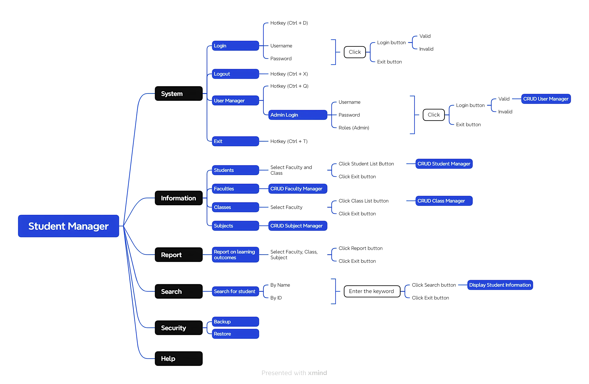

# Student Manager Application Testing Project

## Overview

This repository showcases my practical skills in manual software testing by detailing the comprehensive testing effort conducted on a desktop-based Student Manager application. This project involved in-depth analysis of application functionalities, systematic test case design, thorough execution of functional tests, and direct database verification using SQL.

This project demonstrates my understanding of the Software Testing Life Cycle (STLC) and ability to ensure software quality without formal SRS documentation.

## Project Goal

The primary goal of this project was to ensure the quality, functionality, and data integrity of the Student Manager application through comprehensive manual testing, identifying defects and validating adherence to expected behavior.

## Application Under Test (AUT)

* **Type:** Windows Desktop Application (Windows Forms)
* **Database:** SQL Server
* **Key Modules/Features Tested:**
    * **System:** Login, User Management (Add/Edit/Delete/View Users, Permissions)
    * **Information:** CRUD operations for Students, Faculty, Classes, Subjects
    * **Report:** Student Reports
    * **Search:** Search functionalities across various entities
    * **Security:** Backup and Restore
    * **Help:** Basic help functionalities

## My Role & Contributions

As a Manual Tester on this project, my key contributions included:

* Analyzed application functionalities directly from the Student Manager user interface and mind map, covering System, Information, Report, Search, Security, and Help modules.
* Designed and wrote 80+ detailed test cases for core functionalities, including Login, User Management, Student CRUD operations, Report generation, Backup and Restore.
* Created diverse test data to ensure comprehensive coverage of valid and invalid scenarios.
* Executed Functional Testing on developed test cases, recording results and comparing them against expected outcomes.
* Performed Database Testing by writing and executing SQL queries to verify data integrity and consistency for user, student, faculty, class, and subject information directly in the SQL database.
* Identified and reported defects, providing clear reproduction steps and attaching screenshots/videos.

## Technologies & Tools Used

* **Application Under Test:** Student Manager (Windows Forms Application)
* **Database:** SQL Server
* **Test Case Management:** Google Sheets
* **Defect Tracking:** Jira
* **Database Management:** SQL Server Management Studio (SSMS)
* **Documentation:** Mind map for functional analysis

## Test case files
* [Student Management Testcase (pdf)](./Testcase%20for%20Student%20Management.pdf)
* [Student Management (Google sheet)](https://docs.google.com/spreadsheets/d/1enxku-ye067NVLGmNZoVqwDjF93eHVr_6IlMIinAFcE/edit?usp=sharing)

## Learnings & Takeaways

This project significantly enhanced my practical skills in:

* Proactive functional analysis without formal documentation.
* Systematic test case design and execution.
* Performing effective database validation using SQL queries.
* Understanding the end-to-end testing process for a desktop application.
* Effective defect identification and clear reporting.
